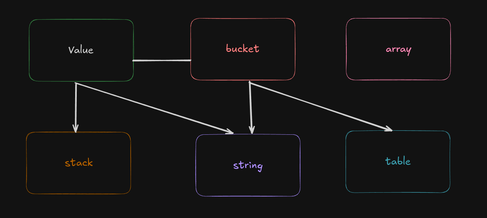

## Contributing

thank you for contributing for Xvr Programming Languages!

## Building block



## Code style

- **Identation** : using **4 spaces** for all Identation
- **Editor Configs**: we recommended configuring your editor to insert 4 spaces when pressing `tab`.

### Example configs
#### Vscode (`.vscode/settings.json`)
```json
{
    "editor.insertSpaces": true,
    "editor.tabSize": 4,
    "editor.trimAutoWhitespace": true,
}
```

#### vim (`.vimrc`)
```vimrc
set tabstop=4
set shiftwidth=4
set expandtab
```

### Data Types

The majority, if not all, of Xvr structure where memory layout matters contains some remarks describing how much
memory they take up dependent on bitness. though they should not be seen as absolute, these remarks are helpful
in considering how the information is presented in memory. they are lined up using spaces

```c
typedef struct Xvr_Stack {
    unsigned int capacity;
    unsigned int count;
    char data[];
} Xvr_Stack;
```

the usage of double pointer is common, particularly when a function operate on a structure instead of merely its contents.
we call tehese `handles` and they are typically called that.

### Error information

by replacing `[info]` with the appropriate output, `fprintf()` will guarantee that the error is published to the console and enable the printing of
further information. instead than indetifying mistake in the Xvr script, these kind of catastrophic erros are meant to indetify problems with the language itself
in the test case, exit `exit(-1)` is instead replace with `return -1` to allow `main()` to clean up that test set, and run others if needed.

```c
fprintf(stderr, XVR_CC_ERROR "error: [info]\n" XVR_CC_RESET);
exit(-1);
```

## testing

a test case must be used to extensively test any new code that is added. if it contains several
features, each one should be tested separately as well as in tandem. it is necessary to fix
any corner case that can cause problems on any supported platform.


