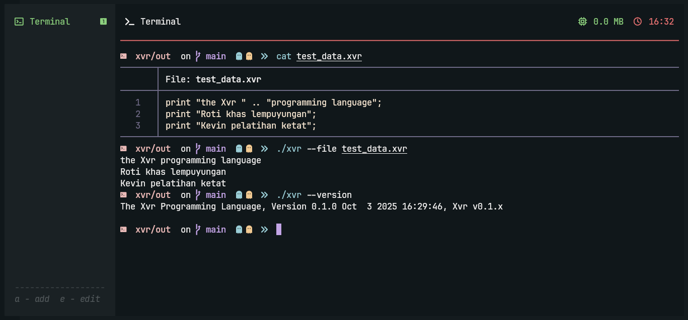

## Feature

- intermediate bytecode interpretation

> [!NOTE]
> For more information about project you can check the [docs](docs) for documentation about xvr, and you can check the sample code from [code](code) directory

## Build Instruction

> [!NOTE]
> For Windows using (mingw32 & Cygwin), For linux or Unix already support compiler

Build interpreter
```sh
# make the interpreter
make inter
# the compilation output
# can check on the /out directory
# including external library
```

```
make tests-cases
make inter
```

## Say wello with Xvr
```
var nama: string = "arfy slowy";

print("wello " + nama);
```

```
var hitung: int = 1;

while (hitung < 10) {
  print(hitung);
  hitung += 1;
}

print ("woilah cik kelar loh ya");
```

```
proc wello(name: string) {
    return "wello " + name;
}

print(wello("xvr"));
```

```
// simple fibonacci

proc fibonacci(number: int): int {
    if (number < 2) {
        return number;
    }

    return fibonacci(number - 1) + fibonacci(number - 2);
}

// with looping using 'for' loops
for (var i: int = 0; i < 30; i++) {
    var hasil = fibonacci(i);
    print(hasil);
}
```

## Need Tutorial?

You can check on [tutorial](docs/tutorial) for explore some tutorials.
