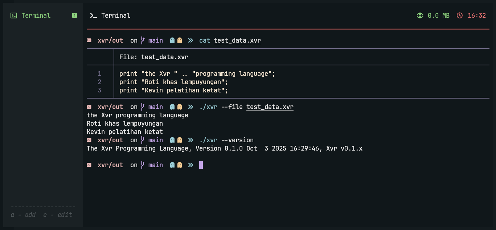

## Feature

- AOT (Ahead-of-Time) compilation using LLVM IR
- Compiles .xvr source files to native executables

> [!NOTE]
> For more information about project you can check the [docs](docs) for documentation about xvr, and you can check the sample code from [code](code) directory

## Build Instruction

> [!NOTE]
> For Windows using (mingw32 & Cygwin), For linux or Unix already support compiler

Build the compiler:
```sh
# Build the xvr compiler (default target)
make

# The compiler output is in ./out/xvr
```

## Usage

```sh
# Compile and run a .xvr file (default)
./out/xvr source.xvr

# Compile to executable
./out/xvr source.xvr -o output

# Compile to object file only
./out/xvr source.xvr -c output.o

# Dump LLVM IR to stdout
./out/xvr source.xvr -l
```

## Say hello with Xvr
```xvr
std::print("Hello, World!");
```

## Print with Format Specifiers
```xvr
std::print("Hello, {}", "World");           // Hello, World
std::print("Number: {}", 42);                // Number: 42
std::print("Float: {}", 3.14);               // Float: 3.14
std::print("{} is {} years old", "arfy", 25);  // arfy is 25 years old

// Arrays
var data: [int] = [1, 2, 3];
std::print("array: {}", data);               // array: 1 2 3
```

XVR uses `{}` placeholders. Supported types: integers, floats, strings, arrays.

## Need Tutorial?

You can check on [tutorial](docs/tutorial) for explore some tutorials.

## Side project XvrLang

- Neovim Syntax highlighting for XvrLang: [xvrlang-treesitter](https://github.com/WargaSlowy/xvrlang-treesitter)
- Vscode Syntax highlighting for XvrLang: [xvrlang-vscode](https://github.com/WargaSlowy/xvrlang-vscode)
